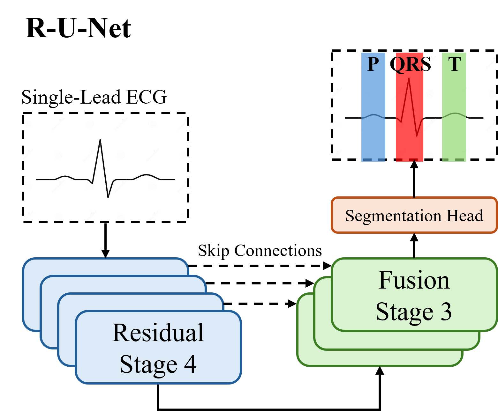

<h2 align="center">
  Decoder Design Matters for ECG Delineation
</h2>

<div align="center">
  
</div>


# Overview
Official Implementation of R-U-Net as proposed in DECODER DESIGN MATTERS FOR ECG DELINEATION by Joseph Scharpf, William Han, Chaojing Duan, Michael A. Rosenberg, Emerson Liu, Ding Zhao.

This repository is largely a thin wrapper around the [SemiSegECG](https://dl.acm.org/doi/10.1145/3746252.3760790).
Currently, we plan to constrain the repository's features to only new models and SSL methods we develop within the SemiSegECG framework.

We plan to release model checkpoints after paper acceptance!

## Installation

1. Clone the repo, `cd` into it, and `uv sync`.

2. `source .venv/bin/activate`

## Data Preparation

1. Download the in-domain and cross-domain waveforms and splits:

```bash
bash scripts/setup_data.sh
```

## Result Reproduction

To run the in-domain benchmark from model training to evaluation, run the following script:

```bash
bash scripts/run_benchmark.sh --dataset ludb --label-fraction 16 --seed 0 --gpus 0
```

For the merged cross-domain protocol, run the following script:

```bash
bash scripts/run_benchmark.sh --dataset cross_domain --seed 0 --gpus 0
```

## Citations
If this work has helped you please cite the following:

```
@misc{scharpf2026decoderdesignmattersecg,
      title={Decoder Design Matters for ECG Delineation}, 
      author={Joseph Scharpf and William Han and Chaojing Duan and Michael A. Rosenberg and Emerson Liu and Ding Zhao},
      year={2026},
      eprint={2609.16489},
      archivePrefix={arXiv},
      primaryClass={cs.LG},
      url={https://arxiv.org/abs/2609.16489}, 
}

@inproceedings{10.1145/3746252.3760790,
  author = {Park, Minje and Lim, Jeonghwa and Yu, Taehyung and Joo, Sunghoon},
  title = {SemiSegECG: A Multi-Dataset Benchmark for Semi-Supervised Semantic Segmentation in ECG Delineation},
  year = {2025},
  isbn = {9798400720406},
  publisher = {Association for Computing Machinery},
  address = {New York, NY, USA},
  url = {https://doi.org/10.1145/3746252.3760790},
  doi = {10.1145/3746252.3760790},
  booktitle = {Proceedings of the 34th ACM International Conference on Information and Knowledge Management},
  pages = {5099–5104},
  numpages = {6},
  location = {Seoul, Republic of Korea},
  series = {CIKM '25}
}
```

## License

MIT, except all third-party models and datasets used in the repository. Please refer to the third-party model and dataset's corresponding licenses.
Specifically, SemiSegECG abides by the Apache License Version 2.0.